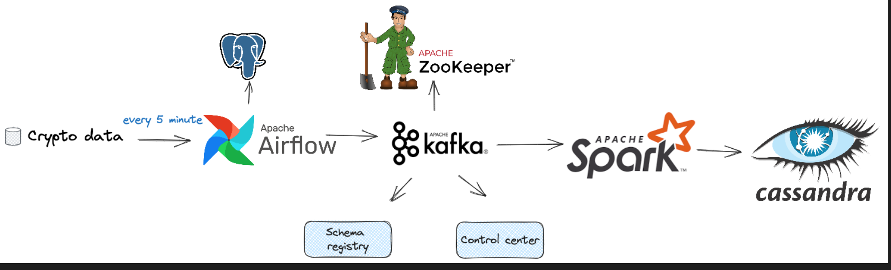

# Introduction
This project serves as a comprehensive guide to building an end-to-end data engineering pipeline. It covers each stage from data ingestion to processing and finally to storage, utilizing a robust tech stack that includes Apache Airflow, Python, Apache Kafka, Apache Zookeeper, Apache Spark, and Cassandra. Everything is containerized using Docker for ease of deployment and scalability.

# Project architecture


- **Data Source**: We use Binance API to get the average price for 6 popular cryto currencies
- **Apache Airflow**: Responsible for orchestrating the pipeline and storing fetched data in a PostgreSQL database.
- **Apache Kafka and Zookeeper**: Used for streaming data from PostgreSQL to the processing engine.
- **Control Center and Schema Registry**: Helps in monitoring and schema management of our Kafka streams.
- **Apache Spark**: For data processing with its master and worker nodes.
- **Cassandra**: Where the processed data will be stored.

# Technologies
- Apache Airflow
- Python
- Apache Kafka
- Apache Zookeeper
- Apache Spark
- Cassandra
- PostgreSQL
- Docker

# Usage
1. Clone the github repo
```bash
    git clone https://github.com/nhattan040102/Crypto_Market_Streaming_Data_pipeline.git
```
2. Navigate to the current project
```bash
    cd Crypto_Market_Streaming_Data_pipeline
```
3. Build image from Dockerfile
```bash
    docker build -t my_airflow_img .
```
4. Run docker-compose to start the service
```bash
    docker compose up -d --build
```